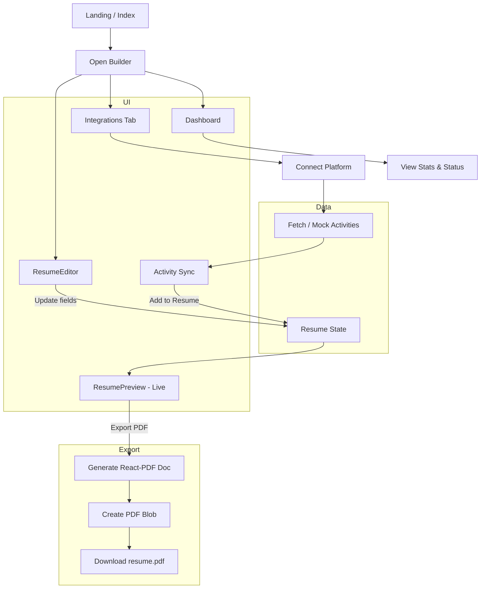

## ResumeForge – Resume Builder

Modern, fast, and extensible resume builder built with React + Vite, Tailwind CSS, and a rich component system. Create a professional resume, sync activities from platforms, and export a text‑selectable PDF.

### Tech Stack

<p>
  
  
  
  
  
  
  
  
</p>

### Key Features
- Live resume editor with instant preview
- Platform integrations (GitHub, LinkedIn, Coursera, LeetCode, Devpost, Kaggle)
- Activity dashboard and sync indicator
- Text‑selectable, single‑page PDF export (vector text, not images)
- Modern UI components (shadcn/ui + Radix + Tailwind)

### Project Structure

```text
.
├─ public/
│  └─ PlatformImages/        # platform logos
├─ src/
│  ├─ components/
│  │  ├─ ResumeEditor.tsx    # editor controls
│  │  ├─ ResumePreview.tsx   # live preview + export action
│  │  ├─ ResumePdf.tsx       # React-PDF document (text selectable)
│  │  ├─ Integration*        # dashboards & integrations
│  │  └─ ui/                 # shadcn/ui components
│  ├─ hooks/
│  ├─ pages/
│  ├─ types/
│  └─ main.tsx
├─ index.html
└─ package.json
```

### Getting Started

0) Prerequisites
- Node.js 18+

1) Clone the repo
```bash
git clone https://your.repo.url/Resume-Builder.git
cd ResumeForge
```

2) Install dependencies
```bash
npm install
```

3) Run locally
```bash
npm run dev
```

### PDF Export (Text‑Selectable)
The app uses a dedicated React‑PDF document (`src/components/ResumePdf.tsx`) to generate a PDF with selectable text and consistent A4 layout. Use the “Export PDF” button in the preview panel to download.

### Approach & Architecture
- Component-first architecture: isolated `ResumeEditor`, `ResumePreview`, `ResumePdf`, and platform integration modules for clarity and maintainability.
- Single source of truth: `Builder` page owns the resume state and passes controlled props to children.
- Progressive integrations: mock data now, with clear extension points for real OAuth/token storage and API sync.
- Export fidelity: React-PDF ensures vector text, predictable A4 sizing, and robust typography; avoids rasterized screenshots.
- Styling discipline: Tailwind + shadcn/ui for consistent primitives; Radix for accessibility and behavior.

### Tools Used
- React, TypeScript, Vite (fast HMR, type-safety)
- Tailwind CSS, shadcn/ui, Radix UI
- React Router, Lucide icons
- React PDF (`@react-pdf/renderer`) for text‑selectable PDFs
- Sonner for notifications

### Key Strategies
- Consistent data flow: unidirectional state in `Builder` + controlled components
- Clear separation of concerns: editing, preview, integration, export
- UX first: instant feedback with toasts and live preview
- Future-ready: integration configs, typed models, and mock flows enable easy backend wiring

### Future Work (Including MongoDB Integration)
- Real platform integrations: OAuth 2.0, token storage, rate-limit handling, retries/backoff
- MongoDB + API backend:
  - Store user profiles, connections, activities, and resume versions
  - Collections: `users`, `connections`, `activities`, `resumes`, `templates`
  - Endpoints: `/auth/*`, `/activities/sync`, `/resume/:id`, `/templates`
  - Background jobs for periodic sync (e.g., BullMQ + Redis)
- Templates & theming: multiple resume themes, tokenized design system, preview diffs
- Advanced PDF layout: auto-pagination, keep-with-next rules, improved typographic control
- Collaboration: version history, branches, shareable links, role-based access
- QA & reliability: unit tests, visual regression tests, E2E flows across browsers

### Mermaid – User Flow

